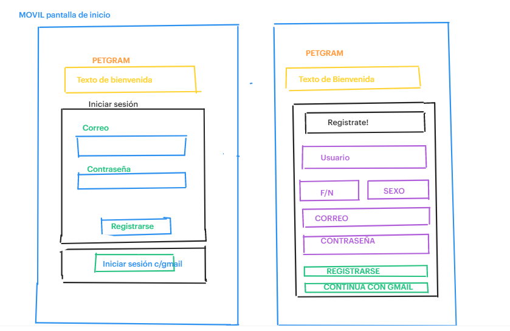
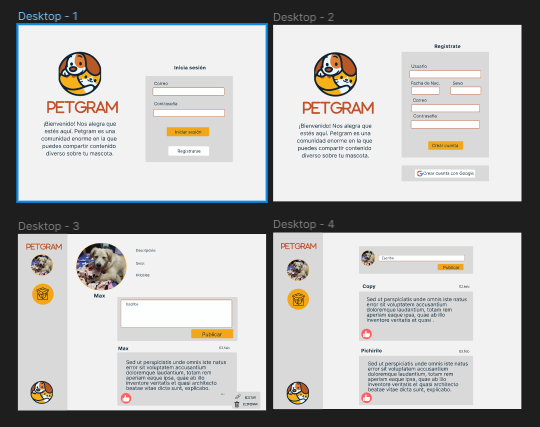
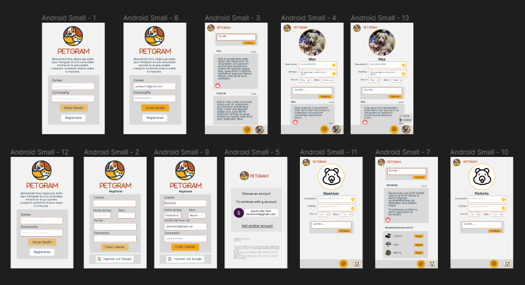

# Creando una Red Social

## Índice

* [1. Introducción](#1-Introducción)
* [2. Resumen del proyecto ](#2-Resumen-del-proyecto)
* [3. Historias de Usuario](#3-Historias-de-Usuario)
* [4. Prototipos](#4-Prototipos)
* [5. Proyecto desplegado](#5-Proyecto-desplegado)
* [6. Proyecto desplegado](#6-Proyecto-desplegado)

## 1. Introducción

Las mascotas son seres que nos acompañan en nuestra vida cotidiana y son parte de nuestra familia. Esta página web es para las personas que quieren compartir comentarios, tips de cuidado, experiencias, etc., sobre sus animalihijos :smile_cat: :hamster: :dog:. 

## 2. Resumen del proyecto

Este proyecto se realizó con VanillaJS, Firebase, HTML y CSS. Se realizó un routeo con windows.location para realizar una Single Page Aplication (SPA). El registro, ingreso y publicación de comentarios (CRUD) se estruturaron con Firebase, con peticiones a la base de datos noSQL de FireStore. También se utilizó templates en la estructura del muro que contenía las publicaciones. La principal herramienta de programación de este proyecto fue el uso de peticiones asíncronas con promises. 

## 3. Historias de Usuarios
Se realizó una encuesta que permitiera establecer los principales intereses de los usuarios. 
Con esta información se establecieron dos historias de usuario: 
### HU1  yo como usuario quiero loguearme para acceder al contenido de PETGRAM.
* Criterio mín. de aceptación
* Que el usuario pueda loguearse desde su teléfono, tablet o desktop.
* Puede registrarse con su correo o cuenta de Gmail.
* Puede registrarse mediante el llenado de datos.

### HU2 yo como usuario quiero postear contenido para interactuar con otros usuarios.
* Criterio mín. de aceptación
* Compartir textos
* Editar y eliminar un post específico
* Darle me gusta 👍🏼 
* Visualizar cuantos likes tiene mi post

## 4. Prototipos
### Baja Fidelidad
Después se realizaron los prototipo de baja fidelidad en el que se diseñaron las vistas que tendría la página, los datos que se iban a solicitar para ingresar y la vista del muro dónde se publicarían los comentarios.

### Alta fidelidad
Posteriormente, se realizaron los protoripos de Alta fidelidad. 

## 5. Proyecto desplegado
Para desplegar la página web se utilizo la herramienta de Hosting de Firabase. 

## 6. Puebas de Usabilidad
Se realizó una encuesta a las personas que utilizaron la aplicación a fin de encontrar mejoras en el diseño de la página web. Los comentarios que destacaron fueron:

* Dar otro formato al botón de salir de la sesión (Log out).
* La combinación de colores. 
* La solicitud de datos para el registro sea más explícita. 

Con estas sugerencias se realizarán algunas modificaciones futuras. 